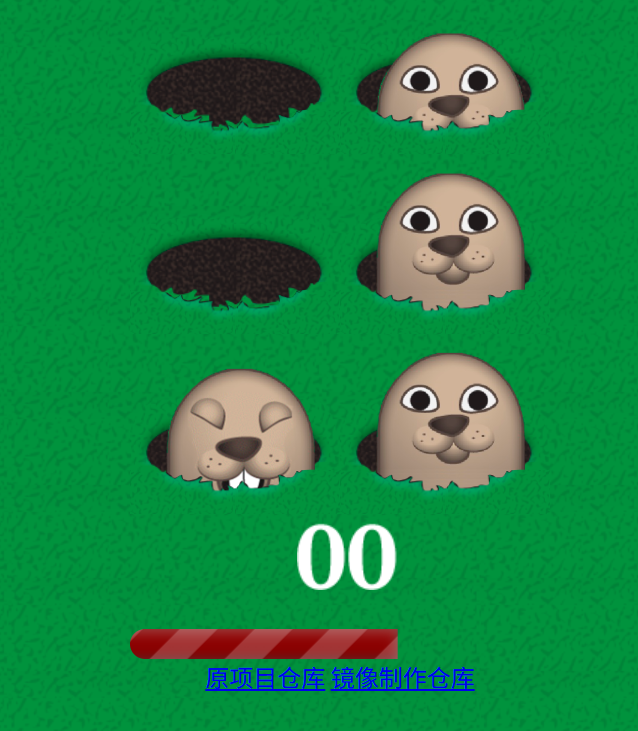

## 汉化&修改

当前制作镜像版本(或截止更新日期)：

首先感谢原作者的开源。[原项目地址](https://github.com/wanghao221/moyu)  
原项目没有中文和docker镜像，我制作了docker镜像


欢迎关注我B站账号 [秦曱凧](https://space.bilibili.com/17547201)

有需要帮忙部署这个项目的朋友,一杯奶茶,即可程远程帮你部署，需要可联系。  
微信号 `E-0_0-`  
闲鱼搜索用户 `明月人间`  
或者邮箱 `firfe163@163.com`  
如果这个项目有帮到你。欢迎start。

有其他的项目的汉化需求，欢迎提issue。或其他方式联系通知。

### 镜像

从阿里云或华为云镜像仓库拉取镜像，注意填写镜像标签，镜像仓库中没有`latest`标签

容器内部端口`5135`，可通过设置启动参数来指定监听端口。

```bash
docker pull swr.cn-north-4.myhuaweicloud.com/firfe/dds-1:2025.08.18
```

### docker run 命令部署

```bash
docker run -d \
--name dds-1 \
--network bridge \
--restart always \
--log-opt max-size=1m \
--log-opt max-file=1 \
-p 5135:5135 \
swr.cn-north-4.myhuaweicloud.com/firfe/dds-1:2025.08.18
```
在命令最后追加`-p 端口`自定义端口

### compose 文件部署 👍推荐

```yaml
#version: '3'
name: dds-1
services:
  dds-1:
    container_name: dds-1
    image: swr.cn-north-4.myhuaweicloud.com/firfe/dds-1:2025.08.18
    network_mode: bridge
    restart: always
    logging:
      options:
        max-size: 1m
        max-file: '1'
    ports:
      - 5135:5135
    # 指定端口
    # command: ["-p", "自定义端口"] 
```


### 效果截图


